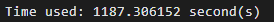
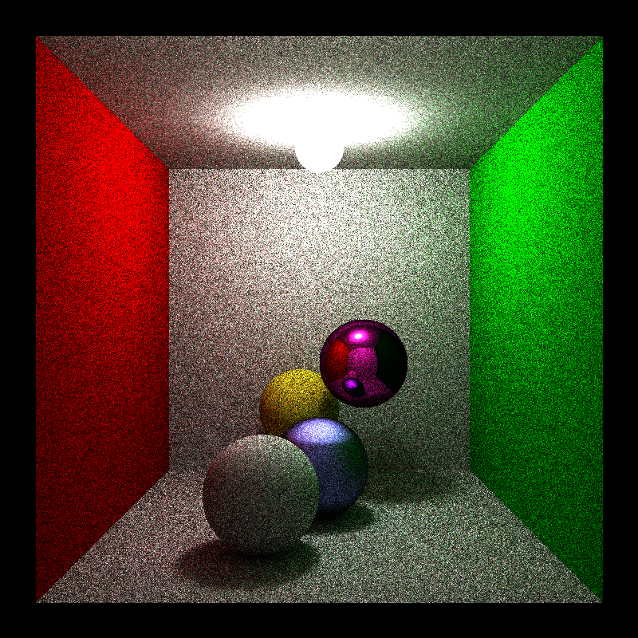
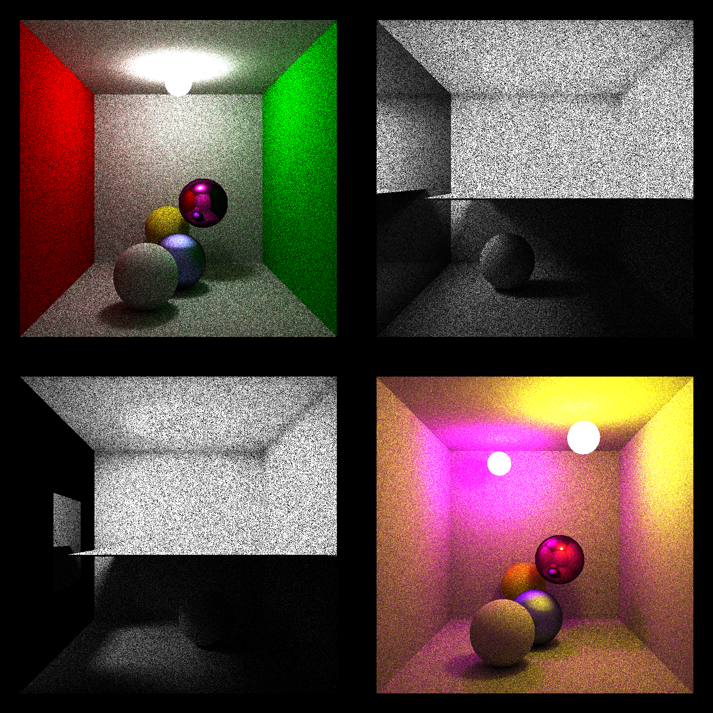
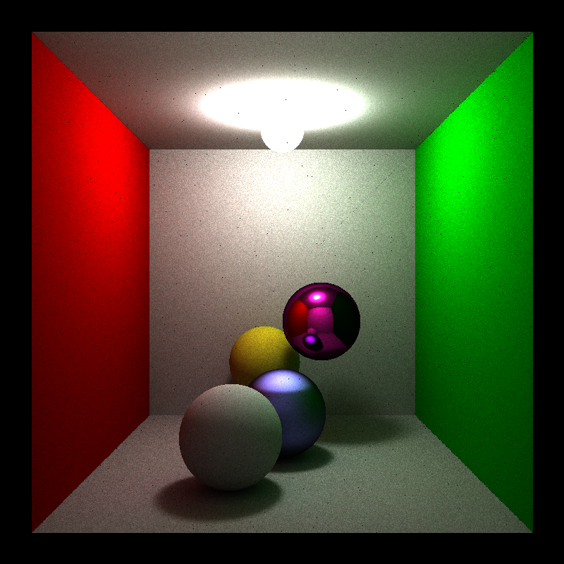

# RayTracing

### 概述 | Overview

CPU 渲染，光线追踪

CPU rendering, ray tracing

### 第三方 | Third

[stb_image_write](https://github.com/nothings/stb)

### 运行结果 | Running results

	./main -s 512 -r 8 -o ./out_512_8.png

---

